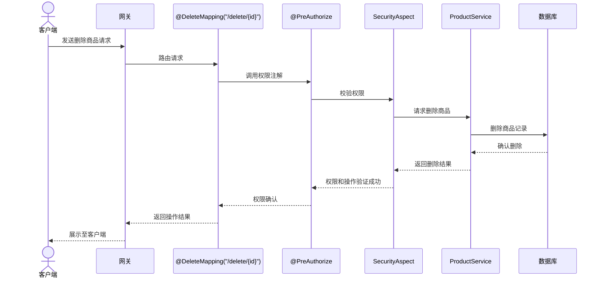
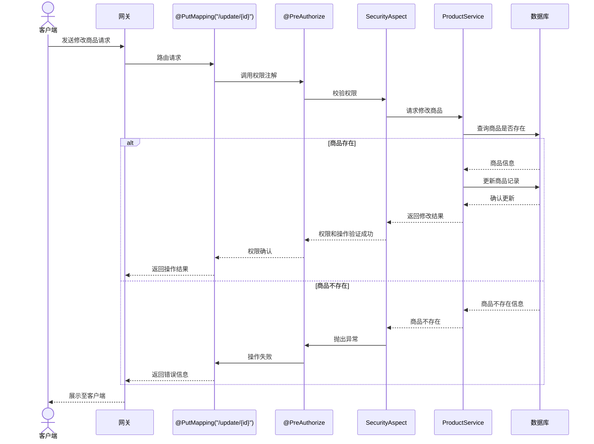
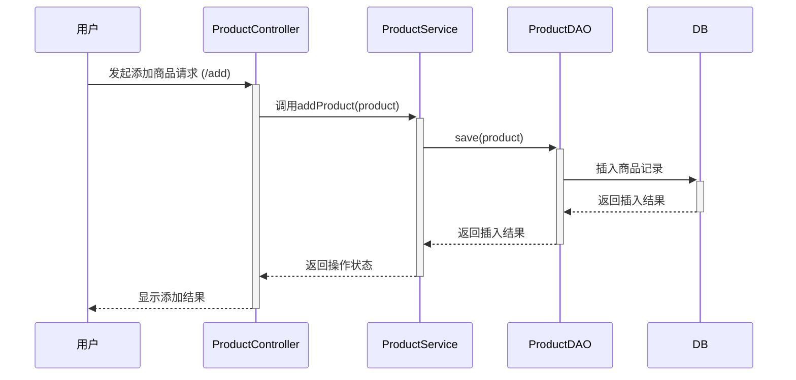
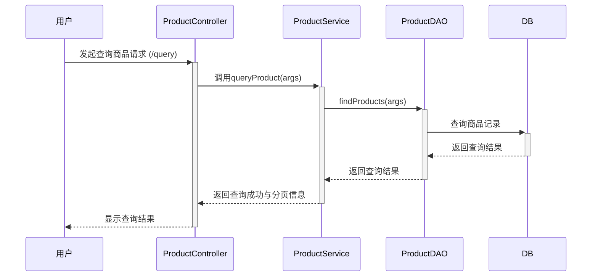

删除商品流程的mermaid时序图：

mermaid



修改商品流程的mermaid时序图：

mermaid



这两个时序图各自描述了删除商品和修改商品的流程。当客户端向服务器发送请求时，请求将通过网关，调用对应的控制器方法，之后执行权限注解定义的权限校验，在AOP中执行自定义的安全检查，并最终进行数据库操作。成功或失败的结果将沿相反的路径返回客户端。

商品增加接口




商品查询接口





表设计

### 商品模块 (`Product`)

**数据表结构:**

```mysql
CREATE TABLE product (
  id BIGINT AUTO_INCREMENT PRIMARY KEY,
  name VARCHAR(255) NOT NULL,
  specification VARCHAR(255),
  price DECIMAL(10, 2) NOT NULL,
  stock INT DEFAULT 0,
  created_time TIMESTAMP DEFAULT CURRENT_TIMESTAMP,
  updated_time TIMESTAMP DEFAULT CURRENT_TIMESTAMP ON UPDATE CURRENT_TIMESTAMP
);
```


### 门店管理模块 (`Store`)

**数据表结构:**

```mysql
CREATE TABLE store (
  id BIGINT AUTO_INCREMENT PRIMARY KEY,
  name VARCHAR(255) NOT NULL,
  address VARCHAR(255),
  phone VARCHAR(15),
  created_time TIMESTAMP DEFAULT CURRENT_TIMESTAMP,
  updated_time TIMESTAMP DEFAULT CURRENT_TIMESTAMP ON UPDATE CURRENT_TIMESTAMP
);
```


### 台账模块 (`Accounting`)

**台账属性:** 对商品出入库行为的动态记录。 **数据表结构:**

```mysql
CREATE TABLE accounting (
  id BIGINT AUTO_INCREMENT PRIMARY KEY,
  product_id BIGINT NOT NULL,
  store_id BIGINT NOT NULL,
  type ENUM('IN', 'OUT') NOT NULL, -- 表示入库或出库
  quantity INT NOT NULL,
  transaction_time TIMESTAMP DEFAULT CURRENT_TIMESTAMP,
  FOREIGN KEY (product_id) REFERENCES product(id),
  FOREIGN KEY (store_id) REFERENCES store(id)
);
```


### 消息模块 (`Message`)

**数据表结构:**

```mysql
CREATE TABLE message (
  id BIGINT AUTO_INCREMENT PRIMARY KEY,
  product_id BIGINT NOT NULL,
  out_time TIMESTAMP,
  content TEXT NOT NULL,
  read_status BOOLEAN DEFAULT FALSE,
  created_time TIMESTAMP DEFAULT CURRENT_TIMESTAMP,
  updated_time TIMESTAMP DEFAULT CURRENT_TIMESTAMP ON UPDATE CURRENT_TIMESTAMP,
  FOREIGN KEY (product_id) REFERENCES product(id)
);
```

